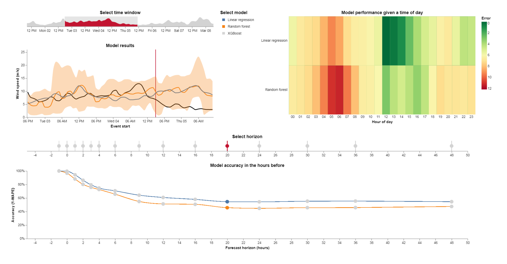
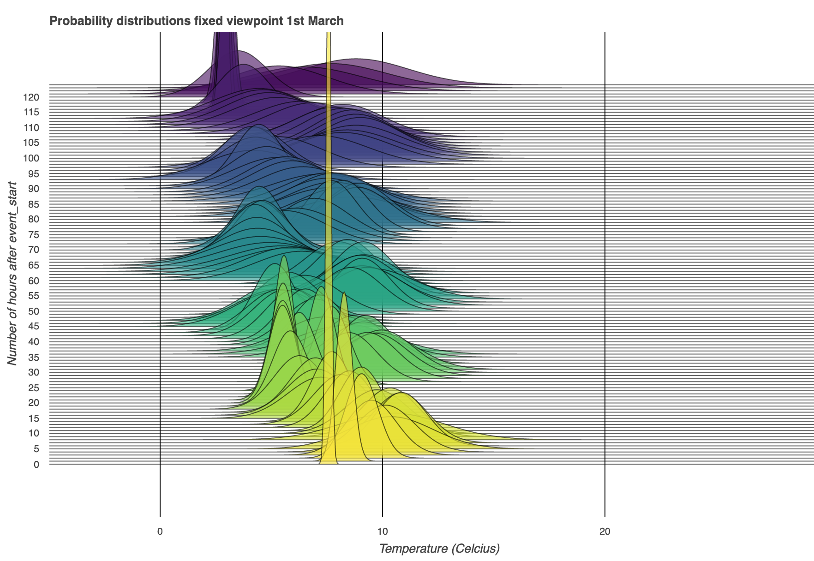

# Timely beliefs

_Model data as beliefs (at a certain time) about events (at a certain time)._

The `timely-beliefs` package provides a convenient data model for numerical time series,
that is both simple enough for humans to understand and sufficiently rich for forecasting and machine learning.
The data model is an extended [pandas](https://pandas.pydata.org/) DataFrame that assigns properties and index levels to describe:

- [What the data is about](timely_beliefs/docs/timing.md/#events-and-sensors)
- Who (or what) created the data
- [When the data was created](timely_beliefs/docs/timing.md/#beliefs-in-physics)
- [How certain they were](timely_beliefs/docs/confidence.md)

Getting started (or try one of the [other ways to create a BeliefsDataFrame](timely_beliefs/docs/init.md)):

    >>> import timely_beliefs as tb
    >>> bdf = tb.BeliefsDataFrame([tb.TimedBelief(tb.Sensor("Indoor temperature", "°C"), tb.BeliefSource("Thermometer"), 21, event_time="2000-03-05 11:00Z", belief_horizon="0H")])
    >>> print(bdf)
                                                                                            event_value
    event_start               belief_time               source      cumulative_probability             
    2000-03-05 11:00:00+00:00 2000-03-05 11:00:00+00:00 Thermometer 0.5                              21

The package contains the following functionality:

- [A model for time series data](#the-data-model), suitable for a notebook or a [database-backed](#database-storage) program (using [sqlalchemy](https://sqlalche.me))
- [Selecting/querying beliefs](timely_beliefs/docs/slicing.md), e.g. those held at a certain moment in time
- [Computing accuracy](#accuracy), e.g. against after-the-fact knowledge, also works with probabilistic forecasts
- [Resampling time series with uncertainty](timely_beliefs/docs/resampling.md/) (experimental)
- [Visualising time series and accuracy metrics](#visualisation) (experimental)

Some use cases of the package:

- Clearly distinguish forecasts from rolling forecasts.
- Analyse your predictive power by showing forecast accuracy as you approach an event.
- Learn **when** someone is a bad predictor.
- Evaluate the risk of being wrong about an event.

Check out [our interactive demonstration](https://forecasting-accuracy.seita.nl/#/demo) comparing forecasting models for renewable energy production.
These visuals are created simply by calling the plot method on our BeliefsDataFrame, using the visualisation library [Altair](https://altair-viz.github.io/).

## Table of contents

1. [The data model](#the-data-model)
1. [Database storage](#database-storage)
1. [Accuracy](#accuracy)
1. [Visualisation](#visualisation)
1. [Development](#development)

## The data model

The BeliefsDataFrame is the basic data model that represents data as probabilistic beliefs about events.
It is an extended pandas DataFrame with the following index levels:

- `event_start`; keeping track of the time of whatever it is that the data point describes (an event)
- `belief_time`; keeping track of the time at which the data point was created (a belief)
- `source`; keeping track of who or what created the data point (a source)
- `cumulative_probability`; keeping track of the confidence in the data point (a probability)

Together these index levels describe data points as probabilistic beliefs.
Because of the sparse representation of index levels (a clever default setting in pandas) we get clean-looking data,
as we show here in a printout of the example BeliefsDataFrame in our examples module:

    >>> import timely_beliefs
    >>> df = timely_beliefs.examples.example_df
    >>> df.head(8)
                                                                                         event_value
    event_start               belief_time               source   cumulative_probability
    2000-01-03 09:00:00+00:00 2000-01-01 00:00:00+00:00 Source A 0.1587                           90
                                                                 0.5000                          100
                                                                 0.8413                          110
                                                        Source B 0.5000                            0
                                                                 1.0000                          100
                              2000-01-01 01:00:00+00:00 Source A 0.1587                           99
                                                                 0.5000                          100
                                                                 0.8413                          101

The first 8 entries of this BeliefsDataFrame show beliefs about a single event.
Beliefs were formed by two distinct sources (A and B), with the first updating its beliefs at a later time.
Source A first thought the value of this event would be 100 ± 10 (the probabilities suggest a normal distribution),
and then increased its accuracy by lowering the standard deviation to 1.
Source B thought the value would be equally likely to be 0 or 100.

More information about what actually constitutes an event is stored as metadata in the BeliefsDataFrame.
The sensor property keeps track of invariable information such as the unit of the data and the resolution of events.

    >>> df.sensor
    <Sensor: Sensor 1>

Currently a BeliefsDataFrame contains data about a single sensor only.
_For a future release we are considering adding the sensor as another index level,
to offer out-of-the-box support for aggregating over multiple sensors._

- [Read more about how to create a BeliefsDataFrame.](timely_beliefs/docs/init.md)
- [Read more about how the DataFrame is keeping track of time.](timely_beliefs/docs/timing.md)
- [Read more about how the DataFrame is keeping track of confidence.](timely_beliefs/docs/confidence.md)
- [Discover convenient slicing methods (e.g. to show a rolling horizon forecast).](timely_beliefs/docs/slicing.md)
- [Serve your data fast by resampling (while taking into account auto-correlation).](timely_beliefs/docs/resampling.md)
- [Track where your data comes from, by following its lineage.](timely_beliefs/docs/lineage.md)

## Database storage

All of the above can be done with `TimedBelief` objects in a `BeliefsDataFrame`.
However, if you are dealing with a lot of data and need performance, you'll want to persist your belief data in a database.

[Read more about how timely-beliefs supports this.](timely_beliefs/docs/db.md)

## Accuracy

The accuracy of a belief is defined with respect to some reference.
The default reference is the most recent belief held by the same source,
but it is possible to set beliefs held by a specific source at a specific time to serve as the reference instead.

There are two common use cases for wanting to know the accuracy of beliefs,
each with a different viewpoint.
With a rolling viewpoint, you get the accuracy of beliefs at a certain `belief_horizon` before (or after) `knowledge_time`,
for example, some days before each event ends.

    >>> df.rolling_viewpoint_accuracy(timedelta(days=2, hours=9), reference_source=df.lineage.sources[0])
                     mae      mape      wape
    source
    Source A    1.482075  0.014821  0.005928
    Source B  125.853250  0.503413  0.503413

With a fixed viewpoint, you get the accuracy of beliefs held at a certain `belief_time`.

    >>> df.fixed_viewpoint_accuracy(datetime(2000, 1, 2, tzinfo=utc), reference_source=df.lineage.sources[0])
                    mae      mape      wape
    source
    Source A    0.00000  0.000000  0.000000
    Source B  125.85325  0.503413  0.503413

For an intuitive representation of accuracy that works in many cases, we suggest to use:

    >>> `df["accuracy"] = 1 - df["wape"]`

[A more detailed discussion of accuracy and error metrics can be found here.](timely_beliefs/docs/accuracy.md)

## Visualisation

Create interactive charts using [Altair](http://altair-viz.github.io) and view them in your browser.

    >>> chart = df.plot(reference_source=df.lineage.sources[0], show_accuracy=True)
    >>> chart.serve()

This will create an interactive Vega-Lite chart like the one in the screenshot at the top of this Readme.

[Read more about built-in visualisation such as ridgeline plots.](timely_beliefs/docs/viz.md)

## Development

The `timely_beliefs` package runs on `pandas>=1.1.5`.
Contact us if you need support for older versions.
We welcome other contributions to `timely_beliefs`.

[See our developer docs for details.](dev/dev.md)
