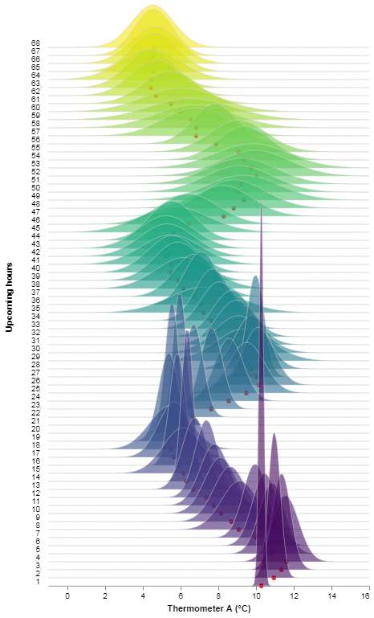
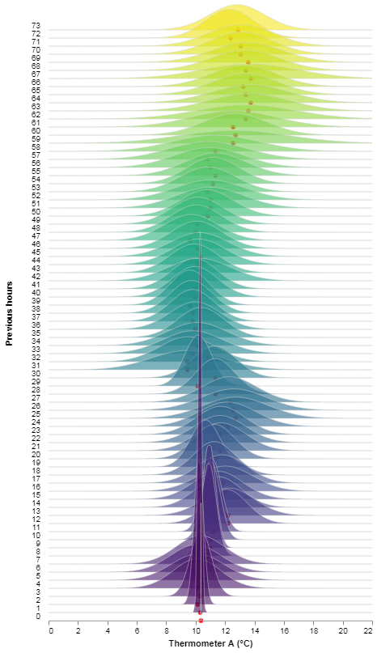

# Timely beliefs

_Model data as beliefs (at a certain time) about events (at a certain time)._

The `timely-beliefs` package provides a convenient data model for numerical time series,
that is both simple enough for humans to understand and sufficiently rich for forecasting and machine learning.
The data model is an extended [pandas](https://pandas.pydata.org/) DataFrame that assigns properties and index levels to describe:

- [What the data is about](#events-and-sensors)
- Who (or what) created the data
- [When the data was created](#beliefs-in-physics)
- [How certain they were](#keeping-track-of-confidence)

The package contains the following functionality:

- [A model for time series data](#the-data-model), suitable for a notebook or a [database-backed](#database-storage) program (using [sqlalchemy](https://sqlalche.me))
- [Selecting/querying beliefs](#convenient-slicing-methods), e.g. those held at a certain moment in time
- [Computing accuracy](#accuracy), e.g. against after-the-fact knowledge, also works with probabilistic forecasts
- [Resampling time series with uncertainty](#resampling) (experimental)
- [Visualising time series and accuracy metrics](#visualisation) (experimental)

Some use cases of the package:

- Clearly distinguish forecasts from rolling forecasts.
- Analyse your predictive power by showing forecast accuracy as you approach an event.
- Learn **when** someone is a bad predictor.
- Evaluate the risk of being wrong about an event.

Check out [our interactive demonstration](http://forecasting-accuracy.seita.nl) comparing forecasting models for renewable energy production.
These visuals are created simply by calling the plot method on our BeliefsDataFrame, using the visualisation library [Altair](https://altair-viz.github.io/).

## Table of contents

1. [The data model](#the-data-model)
   1. [Keeping track of time](#keeping-track-of-time)
      1. [Events and sensors](#events-and-sensors)
      1. [Beliefs in physics](#beliefs-in-physics)
      1. [Beliefs in economics](#beliefs-in-economics)
      1. [A common misconception](#a-common-misconception)
      1. [Special cases](#special-cases)
   1. [Keeping track of confidence](#keeping-track-of-confidence)
   1. [Convenient slicing methods](#convenient-slicing-methods)
      1. [Rolling viewpoint](#rolling-viewpoint)
      1. [Fixed viewpoint](#fixed-viewpoint)
      1. [Belief history](#belief-history)
   1. [Resampling](#resampling)
   1. [Lineage](#lineage)
1. [Database storage](#database-storage)
   1. [Table creation and session](#table-creation-and-session)
   1. [Subclassing](#subclassing)
1. [Accuracy](#accuracy)
   1. [Accuracy and error metrics](#accuracy-and-error-metrics)
   1. [Probabilistic forecasts](#probabilistic-forecasts)
   1. [Probabilistic reference](#probabilistic-reference)
   1. [Viewpoints](#viewpoints)
1. [Visualisation](#visualisation)
   1. [How to interact with the chart](#how-to-interact-with-the-chart)
      1. [Select a time window](#select-a-time-window)
      1. [Select a belief time](#select-a-belief-time)
      1. [Select a horizon](#select-a-horizon)
      1. [Switch viewpoints](#switch-viewpoints)
1. [Development](#development)
1. [More examples](#more-examples)
1. [References](#references)

## The data model

The BeliefsDataFrame is the basic data model that represents data as probabilistic beliefs about events.
It is an extended pandas DataFrame with the following index levels:

- `event_start`; keeping track of the time of whatever it is that the data point describes (an event)
- `belief_time`; keeping track of the time at which the data point was created (a belief)
- `source`; keeping track of who or what created the data point (a source)
- `cumulative_probability`; keeping track of the confidence in the data point (a probability)

Together these index levels describe data points as probabilistic beliefs.
Because of the sparse representation of index levels (a clever default setting in pandas) we get clean-looking data,
as we show here in a printout of the example BeliefsDataFrame in our examples module:

    >>> import timely_beliefs
    >>> df = timely_beliefs.examples.example_df
    >>> df.head(8)
                                                                                         event_value
    event_start               belief_time               source   cumulative_probability
    2000-01-03 09:00:00+00:00 2000-01-01 00:00:00+00:00 Source A 0.1587                           90
                                                                 0.5000                          100
                                                                 0.8413                          110
                                                        Source B 0.5000                            0
                                                                 1.0000                          100
                              2000-01-01 01:00:00+00:00 Source A 0.1587                           99
                                                                 0.5000                          100
                                                                 0.8413                          101

The first 8 entries of this BeliefsDataFrame show beliefs about a single event.
Beliefs were formed by two distinct sources (A and B), with the first updating its beliefs at a later time.
Source A first thought the value of this event would be 100 ± 10 (the probabilities suggest a normal distribution),
and then increased its accuracy by lowering the standard deviation to 1.
Source B thought the value would be equally likely to be 0 or 100.

More information about what actually constitutes an event is stored as metadata in the BeliefsDataFrame.
The sensor property keeps track of invariable information such as the unit of the data and the resolution of events.

    >>> df.sensor
    <Sensor: Sensor 1>

Currently a BeliefsDataFrame contains data about a single sensor only.
_For a future release we are considering adding the sensor as another index level,
to offer out-of-the-box support for aggregating over multiple sensors._

- Read more about how the DataFrame is [keeping track of time](#keeping-track-of-time).
- Read more about how the DataFrame is [keeping track of confidence](#keeping-track-of-confidence).
- Discover [convenient slicing methods](#convenient-slicing-methods), e.g. to show a rolling horizon forecast.
- Serve your data fast by [resampling](#resampling), while taking into account auto-correlation.
- Track where your data comes from, by following its [lineage](#lineage).

### Keeping track of time

#### Events and sensors

Numerical data quantifies something, it is a value assigned to an event;
a physical event, such as a temperature reading, power flow or water flow,
or an economical event, such as daily goods sold or a price agreement about a future delivery.
An event typically takes some time, so it has an `event_start` and an `event_end` time.

To observe an event, we need a sensor. We say that a sensor has a certain `event_resolution`:

    event_resolution = event_end - event_start

We define the resolution to be a fixed property of the sensor. For example:

- An anemometer (wind speed meter) determines the number of revolutions within some period of time.
- A futures contract determines the price of a future delivery within some period of time.

#### Beliefs in physics

Assigning a value to an event implies a belief.
We say that a belief can be formed some time before or after an event, and call this time `belief_time`.
A weather forecast is a good example, where:

    belief_time < event_end

For physical events, the time at which we can say the event could be known (which we call `knowledge_time`) is at the `event_end`.

    knowledge_time = event_end

The forecast horizon, or `belief_horizon`, says how long before (the event could be known) the belief was formed:

    belief_horizon = knowledge_time - belief_time

For example, a forecast of solar irradiation on June 10th 2017 with a horizon of 27 hours means a belief time of 9 PM on June 9th 2017.
That is:

    event_start = datetime(2017, 6, 10, hour=0)
    event_end = datetime(2017, 6, 11, hour=0)
    belief_horizon = timedelta(hours=27)
    belief_time = datetime(2017, 6, 9, hour=21)

#### Beliefs in economics

For economical events, the time at which we say an event could be known is typically not at the `event_end`.
Most contracts deal with future events, such that:

    knowledge_time < event_start

The `knowledge_horizon` says how long before (the event starts) the event could be known:

    knowledge_horizon > 0  # for most economical events
    knowledge_horizon = -resolution  # for physical events

We define the knowledge horizon to be a fixed property of the sensor.
For example, hourly prices on the day-ahead electricity market are determined at noon one day before delivery starts, such that:

    knowledge_time = event_start.replace(hour=12) - timedelta(days=1)

Then for an hourly price between 3 and 4 PM on June 10th 2017:
  
    event_start = datetime(2017, 6, 10, hour=15)
    event_end = datetime(2017, 6, 10, hour=16)
    knowledge_time = datetime(2017, 6, 9, hour=12)
    knowledge_horizon = timedelta(hours=27)

Continuing this example, a price forecast with a forecast horizon of 1 hour constitutes a belief formed at 11 AM:

    belief_horizon = timedelta(hours=1)
    belief_time = datetime(2017, 6, 9, hour=11)

In general, we have the following relationships:

    belief_time + belief_horizon = knowledge_time
    belief_time + belief_horizon + knowledge_horizon = event_start
    belief_time + belief_horizon + knowledge_horizon + event_resolution = event_end

#### A common misconception

In many applications, people tend to interpret a forecast horizon as the duration between forming the belief and the start of the event.
When this happens, we have:

    forecast_horizon = event_start - belief_time

and:

    forecast_horizon = belief_horizon + knowledge_horizon

For example, consider a forecast formed at 9 AM about the average wind speed between 10 and 11 AM.
It may feel intuitive to talk about a forecast horizon of 1 hour, because people tend to index events by their start time and then talk about the timing of beliefs with respect to that index.

While this is a perfectly acceptable definition, we set out to be precise in handling the timing of beliefs.
Therefore, we use the term `belief_horizon` rather than `forecast_horizon` throughout the `timely-beliefs` package.

#### Special cases

##### Instantaneous events

Instantaneous events can be modelled by defining a sensor with:

    event_resolution = 0

##### Past events

Beliefs about past events can be modelled using a negative horizon:

    belief_horizon < 0
    knowledge_time < belief_time

That is, your beliefs can still change after you (think you) know about an event.
NB in the following case a price has been determined (you could know about it) for a future event:

    knowledge_time < belief_time < event_start

##### Ex-post knowledge

Our concept of `knowledge_time` supports to define sensors for agreements about ongoing or past events, such as ex-post contracts.

    event_start < knowledge_time
    -resolution < knowledge_horizon < 0  # for ongoing events
    knowledge_horizon < -resolution  # for past events

### Keeping track of confidence

To keep track of the confidence of a data point, timely-beliefs works with probability distributions.
More specifically, the BeliefsDataFrame contains points of interest on the cumulative distribution function (CDF),
and leaves it to the user to set an interpolation policy between those points.
This allows you to describe both discrete possible event values (as a probability mass function) and continuous possible event values (as a probability density function).
A point of interest on the CDF is described by the `cumulative_probability` index level (ranging between 0 and 1) and the `event_value` column (a possible value).

The default interpolation policy is to interpret the CDF points as discrete possible event values,
leading to a non-decreasing step function as the CDF.
In case an event value with a cumulative probability of 1 is missing, the last step is extended to 1 (i.e. the chance of an event value that is greater than largest available event value is taken to be 0).

A deterministic belief consists of a single row in the BeliefsDataFrame.
Regardless of the cumulative probability actually listed (we take 0.5 by default),
the default interpolation policy will interpret the single CDF point as an event value stated with 100% certainty. 
The reason why we choose a default cumulative probability of 0.5 instead of 1 is that, in our experience, sources more commonly intend to report their expected value rather than an event value with absolute confidence.

A probabilistic belief consists of multiple rows in the BeliefsDataFrame,
with a shared `event_start`, `belief_time` and `source`, but different `cumulative_probability` values.
_For a future release we are considering adding interpolation policies to interpret the CDF points as describing a normal distribution or a (piecewise) uniform distribution,
to offer out-of-the-box support for resampling continuous probabilistic beliefs._

### Convenient slicing methods

Being an extension of the pandas DataFrame, all of pandas excellent slicing methods are available on the BeliefsDataFrame.
For example, to select all beliefs about events from 11 AM onwards:

    >>> from datetime import datetime, timedelta
    >>> from pytz import utc
    >>> df = timely_beliefs.examples.example_df
    >>> df[df.index.get_level_values("event_start") >= datetime(2000, 1, 3, 11, tzinfo=utc)]

Besides these, `timely-beliefs` provides custom methods to conveniently slice through time in different ways.

#### Rolling viewpoint

Select the latest forecasts from a rolling viewpoint (beliefs formed at least 2 days and 10 hours before the event could be known):

    >>> df.rolling_viewpoint(timedelta(days=2, hours=10))
                                                                               event_value
    event_start               belief_horizon  source   cumulative_probability
    2000-01-03 10:00:00+00:00 2 days 10:15:00 Source A 0.1587                          180
                                                       0.5000                          200
                                                       0.8413                          220
                                              Source B 0.5000                            0
                                                       1.0000                          200
    2000-01-03 11:00:00+00:00 2 days 10:15:00 Source A 0.1587                          297
                                                       0.5000                          300
                                                       0.8413                          303
                                              Source B 0.5000                            0
                                                       1.0000                          300
    2000-01-03 12:00:00+00:00 2 days 11:15:00 Source A 0.1587                          396
                                                       0.5000                          400

#### Fixed viewpoint

Select the latest forecasts from a fixed viewpoint (beliefs formed at least before 2 AM January 1st 2000:

    >>> df.fixed_viewpoint(datetime(2000, 1, 1, 2, tzinfo=utc)).head(8)
                                                                                         event_value
    event_start               belief_time               source   cumulative_probability
    2000-01-03 09:00:00+00:00 2000-01-01 01:00:00+00:00 Source A 0.1587                           99
                                                                 0.5000                          100
                                                                 0.8413                          101
                                                        Source B 0.5000                            0
                                                                 1.0000                          100
    2000-01-03 10:00:00+00:00 2000-01-01 01:00:00+00:00 Source A 0.1587                          198
                                                                 0.5000                          200
                                                                 0.8413                          202

#### Belief history

Select a history of beliefs about a single event:

    >>> df.belief_history(datetime(2000, 1, 3, 11, tzinfo=utc))
                                                               event_value
    belief_time               source   cumulative_probability
    2000-01-01 00:00:00+00:00 Source A 0.1587                          270
                                       0.5000                          300
                                       0.8413                          330
                              Source B 0.5000                            0
                                       1.0000                          300
    2000-01-01 01:00:00+00:00 Source A 0.1587                          297
                                       0.5000                          300
                                       0.8413                          303
                              Source B 0.5000                            0
                                       1.0000                          300

### Resampling

BeliefsDataFrames come with a custom resample method `.resample_events()` to infer new beliefs about underlying events over time (upsampling) or aggregated events over time (downsampling).

Resampling a BeliefsDataFrame can be an expensive operation, especially when the frame contains beliefs from multiple sources and/or probabilistic beliefs.

#### Upsampling

Upsample to events with a resolution of 5 minutes:

    >>> from datetime import timedelta
    >>> df = timely_beliefs.examples.example_df
    >>> df5m = df.resample_events(timedelta(minutes=5))
    >>> df5m.sort_index(level=["belief_time", "source"]).head(9)
                                                                                         event_value
    event_start               belief_time               source   cumulative_probability
    2000-01-03 09:00:00+00:00 2000-01-01 00:00:00+00:00 Source A 0.1587                         90.0
                                                                 0.5000                        100.0
                                                                 0.8413                        110.0
    2000-01-03 09:05:00+00:00 2000-01-01 00:00:00+00:00 Source A 0.1587                         90.0
                                                                 0.5000                        100.0
                                                                 0.8413                        110.0
    2000-01-03 09:10:00+00:00 2000-01-01 00:00:00+00:00 Source A 0.1587                         90.0
                                                                 0.5000                        100.0
                                                                 0.8413                        110.0

When resampling, the event resolution of the underlying sensor remains the same (it's still a fixed property of the sensor):

    >>> df.sensor.event_resolution == df5m.sensor.event_resolution
    True

However, the event resolution of the BeliefsDataFrame is updated, as well as knowledge horizons and knowledge times: 

    >>> df5m.event_resolution
    datetime.timedelta(seconds=300)
    >>> -df.knowledge_horizons[0]  # note negative horizons denote "after the fact", and the original resolution was 15 minutes
    Timedelta('0 days 00:15:00')
    >>> -df5m.knowledge_horizons[0]
    Timedelta('0 days 00:05:00')

#### Downsampling

Downsample to events with a resolution of 2 hours:

    >>> df2h = df.resample_events(timedelta(hours=2))
    >>> df2h.sort_index(level=["belief_time", "source"]).head(15)
                                                                                         event_value
    event_start               belief_time               source   cumulative_probability
    2000-01-03 09:00:00+00:00 2000-01-01 00:00:00+00:00 Source A 0.158700                       90.0
                                                                 0.500000                      100.0
                                                                 1.000000                      110.0
    2000-01-03 10:00:00+00:00 2000-01-01 00:00:00+00:00 Source A 0.025186                      225.0
                                                                 0.079350                      235.0
                                                                 0.133514                      240.0
                                                                 0.212864                      245.0
                                                                 0.329350                      250.0
                                                                 0.408700                      255.0
                                                                 0.579350                      260.0
                                                                 0.750000                      265.0
                                                                 1.000000                      275.0
    2000-01-03 12:00:00+00:00 2000-01-01 00:00:00+00:00 Source A 0.158700                      360.0
                                                                 0.500000                      400.0
                                                                 1.000000                      440.0
    >>> -df2h.knowledge_horizons[0]
    Timedelta('0 days 02:00:00')

Notice the time-aggregation of probabilistic beliefs about the two events between 10 AM and noon.
Three possible outcomes for both events led to nine possible worlds, because downsampling assumes by default that the values indicate discrete possible outcomes.

### Lineage

Get the (number of) sources contributing to the BeliefsDataFrame:

    >>> df.lineage.sources
    array([<BeliefSource Source A>, <BeliefSource Source B>], dtype=object)
    >>> df.lineage.number_of_sources
    2

## Database storage

All of the above can be done with `TimedBelief` objects in a `BeliefsDataFrame`. However, if you are dealing with a lot of data and need performance, you'll want to persist your belief data in a database. The timely-beliefs library supports this, as all relevant classes have a subclass which also derives from [sqlalchemy's declarative base](https://docs.sqlalchemy.org/en/13/orm/extensions/declarative/index.html?highlight=declarative).

The timely-beliefs library comes with database-backed classes for the three main components of the data model - `DBTimedBelief`, `DBSensor` and `DBBeliefSource`. Objects from these classes can be used just like their super classes, so for instance `DBTimedBelief` objects can be used for creating a `BeliefsDataFrame`.

### Table creation and storage

You can let sqlalchemy create the tables in your database session and start using the DB classes (or subclasses, see below) and program code without much work by yourself. The database session is under your control - where or how you get it, depends on the context you're working in. Here is an example how to set up a session and also have sqlachemy create the tables:

    from timely_beliefs.db_base import Base as TBBase
    from sqlalchemy.orm import sessionmaker

    SessionClass = sessionmaker()
    session = None

    def create_db_and_session():
        engine = create_engine("your-db-connection-string")
        SessionClass.configure(bind=engine)

        TBBase.metadata.create_all(engine)

        if session is None:
            session = SessionClass()

        # maybe add some inital sensors and sources to your session here ...

        return session

Note how we're using timely-belief's sqlalchemy base (we're calling it `TBBase`) to create them. This does not create other tables you might have in your data model:

    session = create_db_and_session()
    for table_name in ("belief_source", "sensor", "timed_beliefs"):
        assert table_name in session.tables.keys()

Now you can add objects to your database and query them:

    from timely_beliefs import DBBeliefSource, DBSensor, DBTimedBelief

    source = DBBeliefSource(name="my_mom")
    session.add(source)

    sensor = DBSensor(name="AnySensor")
    session.add(sensor)

    session.flush()

    now = datetime.now(tz=timezone("Europe/Amsterdam"))
    belief = DBTimedBelief(
        sensor=sensor,
        source=source,
        belief_time=now,
        event_start=now + timedelta(minutes=3),
        value=100,
    )
    session.add(belief)

    q = session.query(DBTimedBelief).filter(DBTimedBelief.event_value == 100)
    assert q.count() == 1
    assert q.first().source == source
    assert q.first().sensor == sensor
    assert sensor.beliefs == [belief]

### Subclassing

`DBTimedBelief`, `DBSensor` and `DBBeliefSource` also can be subclassed, for customization purposes. Possible reasons are to add more attributes or to use an existing table with a different name.

Adding fields should be most interesting for sensors and maybe belief sources.
Below is an example, for the case of a db-backed case, where we wanted a sensor to have a location. We added three attributes, `latitude`, `longitude` and `location_name`:

    from timely_beliefs import DBSensor
    from sqlalchemy import Column, Float, String

    class DBLocatedSensor(DBSensor):
        """A sensor with a location lat/long and location name"""

        latitude = Column(Float(), nullable=False)
        longitude = Column(Float(), nullable=False)
        location_name = Column(String(80), nullable=False)

        def __init__(
            self,
            latitude: float = None,
            longitude: float = None,
            location_name: str = "",
            **kwargs,
        ):
            self.latitude = latitude
            self.longitude = longitude
            self.location_name = location_name
            DBSensor.__init__(self, **kwargs)

Changing the table name is more tricky. Here is a class where we do that. This one uses a Mixin class (which is also used to create the class `DBTimedBelief` which we saw above) ― so we have to do more work, but also have more freedom to influence lower-level things such as the `table_name` attribute and pointing to a customer table for belief sources ("my_belief_source"):

    from sqlalchemy import Column, Float, ForeignKey
    from sqlalchemy.orm import backref, relationship
    from sqlalchemy.ext.declarative import declared_attr
    
    from timely_beliefs.beliefs.classes import TimedBeliefDBMixin

    class JoyfulBeliefInCustomTable(Base, TimedBeliefDBMixin):

        __tablename__ = "my_timed_belief"

        happiness = Column(Float(), default=0)

        @declared_attr
        def source_id(cls):
            return Column(Integer, ForeignKey("my_belief_source.id"), primary_key=True)

        source = relationship(
            "RatedSourceInCustomTable", backref=backref("beliefs", lazy=True)
        )

        def __init__(self, sensor, source, happiness: float = None, **kwargs):
            self.happiness = happiness
            TimedBeliefDBMixin.__init__(self, sensor, source, **kwargs)
            Base.__init__(self)

Note that we don say where the sqlalchemy `Base` comes from here. This is the one from your project. If you create tables from timely_belief's Base (see above) as well, you end up with more tables that you probably want to use. Which is not a blocker, but for cleanliness you might want to get all tables from timely beliefś base or define all Table implementations yourself, such as with `JoyfulBeliefInCustomTable` above.

## Accuracy

The accuracy of a belief is defined with respect to some reference.
The default reference is the most recent belief held by the same source,
but it is possible to set beliefs held by a specific source at a specific time to serve as the reference instead.

### Accuracy and error metrics

To our knowledge, there is no standard metric for accuracy.
However, there are some standard metrics for what can be considered to be its opposite: error.
By default, we give back the Mean Absolute Error (MAE),
the Mean Absolute Percentage Error (MAPE)
and the Weighted Absolute Percentage Error (WAPE).
Each of these metrics is a representation of how wrong a belief is (believed to be),
with its convenience depending on use case.
For example, for intermittent demand time series (i.e. sparse data with lots of zero values) MAPE is not a useful metric.
For an intuitive representation of accuracy that works in many cases, we suggest to use `df["accuracy"] = 1 - df["wape"]`.
With this definition:

- 100% accuracy denotes that all values are correct
- 50% accuracy denotes that, on average, the values are wrong by half of the reference value
- 0% accuracy denotes that, on average, the values are wrong by exactly the reference value (i.e. zeros or twice the reference value)
- negative accuracy denotes that, on average, the values are off-the-chart wrong (by more than the reference value itself)

### Probabilistic forecasts

The previous metrics (MAE, MAPE and WAPE) are technically not defined for probabilistic beliefs.
However, there is a straightforward generalisation of MAE called the Continuous Ranked Probability Score (CRPS), which is used instead.
The other metrics follow by dividing over the deterministic reference value.
For simplicity in usage of the `timely-beliefs` package,
the metrics names in the BeliefsDataFrame are the same regardless of whether the beliefs are deterministic or probabilistic.

### Probabilistic reference

It is possible that the reference itself is a probabilistic belief rather than a deterministic belief.
Our implementation of CRPS handles this case, too, by calculating the distance between the cumulative distribution functions of each forecast and reference [(Hans Hersbach, 2000)](#references).
As the denominator for calculating MAPE and WAPE, we use the expected value of the probabilistic reference.

### Viewpoints

There are two common use cases for wanting to know the accuracy of beliefs,
each with a different viewpoint.
With a rolling viewpoint, you get the accuracy of beliefs at a certain `belief_horizon` before (or after) `knowledge_time`,
for example, some days before each event ends.

    >>> df.rolling_viewpoint_accuracy(timedelta(days=2, hours=9), reference_source=df.lineage.sources[0])
                     mae      mape      wape
    source
    Source A    1.482075  0.014821  0.005928
    Source B  125.853250  0.503413  0.503413

With a fixed viewpoint, you get the accuracy of beliefs held at a certain `belief_time`.

    >>> df.fixed_viewpoint_accuracy(datetime(2000, 1, 2, tzinfo=utc), reference_source=df.lineage.sources[0])
                    mae      mape      wape
    source
    Source A    0.00000  0.000000  0.000000
    Source B  125.85325  0.503413  0.503413

## Visualisation

Create interactive charts using [Altair](http://altair-viz.github.io) and view them in your browser.

    >>> chart = df.plot(reference_source=df.lineage.sources[0], show_accuracy=True)
    >>> chart.serve()

This will create an interactive Vega-Lite chart [(Satyanarayan et al., 2016)](#references) like the one in the screenshot at the top of this Readme.
At this time, we chose to show the (possibly more intuitive) forecast horizon for visualisation,
rather than our more precise definition of belief horizon.

### How to interact with the chart

#### Select a time window

Click and drag in `Select time window` to zoom in on a subset of your data.
You can then drag your selected time window to move through time.
Reset with a double click.

#### Select a belief time

Travel through time as you select a belief time by clicking in `Model results`.
Reset with a double click.

#### Select a horizon

Look only at what was believed some duration before each event by clicking in `Select forecasting horizon`.
Double click to select all horizons.

#### Switch viewpoints

The chart allows you to switch between a fixed and rolling viewpoint as follows:
- **Fixed viewpoint**: first select all horizons by double clicking in `Select forecasting horizon`, then click anywhere in `Model results` to travel through time.
- **Rolling viewpoint**: first click somewhere on the far right in `Model results` to look back at the full range of your data, then select a specific horizon by clicking in `Select forecasting horizon`.

### Ridgeline plots

Create ridgeline plots showing how the confidence of beliefs improves as we approach an event (by plotting a belief history),
or deteriorates as we look further into the future (by taking a fixed viewpoint).

#### Belief history

A ridgeline plot of a belief history (e.g. of temperature forecasts) can be created as follows:

    >>> df = timely_beliefs.examples.temperature_df
    >>> chart = df.plot_ridgeline_belief_history(
            datetime(2015, 3, 1, 13, 0, tzinfo=pytz.utc),
            df,
            past_only=True,
            distribution="normal",
            event_value_window=(0, 22),
        )
    >>> chart.serve()

#### Fixed viewpoint

A ridgeline plot of beliefs (e.g. temperature forecasts) with a fixed viewpoint can be created as follows:

    >>> df = timely_beliefs.examples.temperature_df
    >>> chart = df.plot_ridgeline_fixed_viewpoint(
            datetime(2015, 3, 1, 13, 0, tzinfo=pytz.utc),
            df,
            future_only=True,
            distribution="normal",
            event_value_window=(-1, 16),
        )
    >>> chart.serve()
    

## Development

We welcome other contributions to timely_beliefs. 

As a developer, you can build the code like this:

    make install

For testing, add a local database with expected credentials, for instance like this:

    sudo -u postgres psql                                          
    postgres=# CREATE USER tbtest WITH PASSWORD 'tbtest';
    postgres=# CREATE DATABASE tbtest WITH OWNER = tbtest;
    postgres=# exit

or this:

    docker run --name test-postgres -p 5432:5432 -e POSTGRES_PASSWORD=tbtest -e POSTGRES_USER=tbtest -e POSTGRES_DB_NAME=tbtest -d postgres

And run tests:

    make test

## More examples

...

## References

- Hans Hersbach. [Decomposition of the Continuous Ranked Probability Score for Ensemble Prediction Systems](https://journals.ametsoc.org/doi/pdf/10.1175/1520-0434%282000%29015%3C0559%3ADOTCRP%3E2.0.CO%3B2) in Weather and Forecasting, Volume 15, No. 5, pages 559-570, 2000.
- Arvind Satyanarayan, Dominik Moritz, Kanit Wongsuphasawat, and Jeffrey Heer. [Vega-Lite: A Grammar of Interactive Graphics](https://idl.cs.washington.edu/files/2017-VegaLite-InfoVis.pdf) in IEEE transactions on visualization and computer graphics, Volume 23, No. 1, pages 341-350, 2016.
