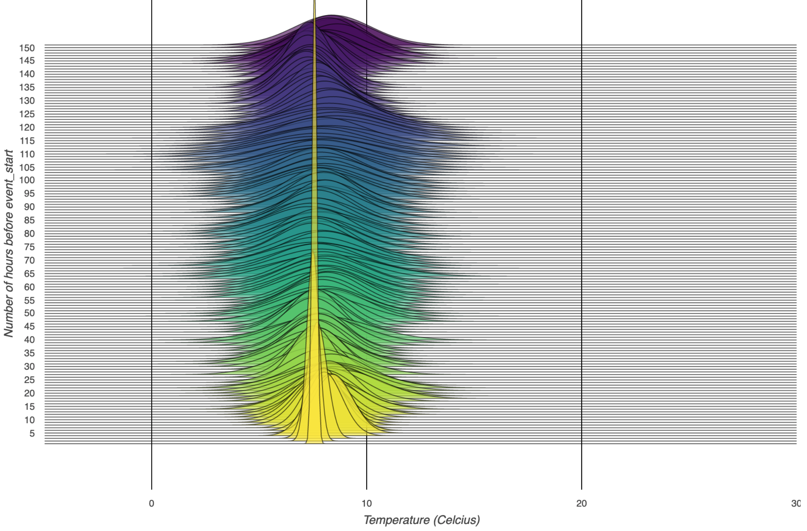

# Visualisation

Create interactive charts using [Altair](http://altair-viz.github.io) and view them in your browser.

    >>> chart = df.plot(reference_source=df.lineage.sources[0], show_accuracy=True)
    >>> chart.serve()

This will create an interactive Vega-Lite chart [(Satyanarayan et al., 2016)](#references) like the one in the screenshot at the top of [our main Readme](README.md).
At this time, we chose to show the (possibly more intuitive) forecast horizon for visualisation,
rather than our more precise definition of belief horizon.

## Table of contents

1. [How to interact with the chart](#how-to-interact-with-the-chart)
    1. [Select a time window](#select-a-time-window)
    1. [Select a belief time](#select-a-belief-time)
    1. [Select a horizon](#select-a-horizon)
    1. [Switch viewpoints](#switch-viewpoints)
1. [Ridgeline plots](#ridgeline-plots)
    1. [Belief history](#belief-history)
    1. [Fixed viewpoint](#fixed-viewpoint)
1. [References](#references)

## How to interact with the chart

### Select a time window

Click and drag in `Select time window` to zoom in on a subset of your data.
You can then drag your selected time window to move through time.
Reset with a double click.

### Select a belief time

Travel through time as you select a belief time by clicking in `Model results`.
Reset with a double click.

### Select a horizon

Look only at what was believed some duration before each event by clicking in `Select forecasting horizon`.
Double click to select all horizons.

### Switch viewpoints

The chart allows you to switch between a fixed and rolling viewpoint as follows:
- **Fixed viewpoint**: first select all horizons by double clicking in `Select forecasting horizon`, then click anywhere in `Model results` to travel through time.
- **Rolling viewpoint**: first click somewhere on the far right in `Model results` to look back at the full range of your data, then select a specific horizon by clicking in `Select forecasting horizon`.

## Ridgeline plots

Create ridgeline plots showing how the confidence of beliefs improves as we approach an event (by plotting a belief history),
or deteriorates as we look further into the future (by taking a fixed viewpoint).

### Belief history

A ridgeline plot of a belief history (e.g. of temperature forecasts) can be created as follows:

    >>> df = timely_beliefs.examples.get_temperature_df()
    >>> chart = df.plot_ridgeline_belief_history(
            datetime(2015, 3, 1, 13, 0, tzinfo=pytz.utc),
            df,
            past_only=True,
            distribution="normal",
            event_value_window=(0, 22),
        )
    >>> chart.serve()

### Fixed viewpoint

A ridgeline plot of beliefs (e.g. temperature forecasts) with a fixed viewpoint can be created as follows:

    >>> df = timely_beliefs.examples.get_temperature_df()
    >>> chart = df.plot_ridgeline_fixed_viewpoint(
            datetime(2015, 3, 1, 13, 0, tzinfo=pytz.utc),
            df,
            future_only=True,
            distribution="normal",
            event_value_window=(-1, 16),
        )
    >>> chart.serve()
    

## References

- Arvind Satyanarayan, Dominik Moritz, Kanit Wongsuphasawat, and Jeffrey Heer. [Vega-Lite: A Grammar of Interactive Graphics](https://idl.cs.washington.edu/files/2017-VegaLite-InfoVis.pdf) in IEEE transactions on visualization and computer graphics, Volume 23, No. 1, pages 341-350, 2016.
